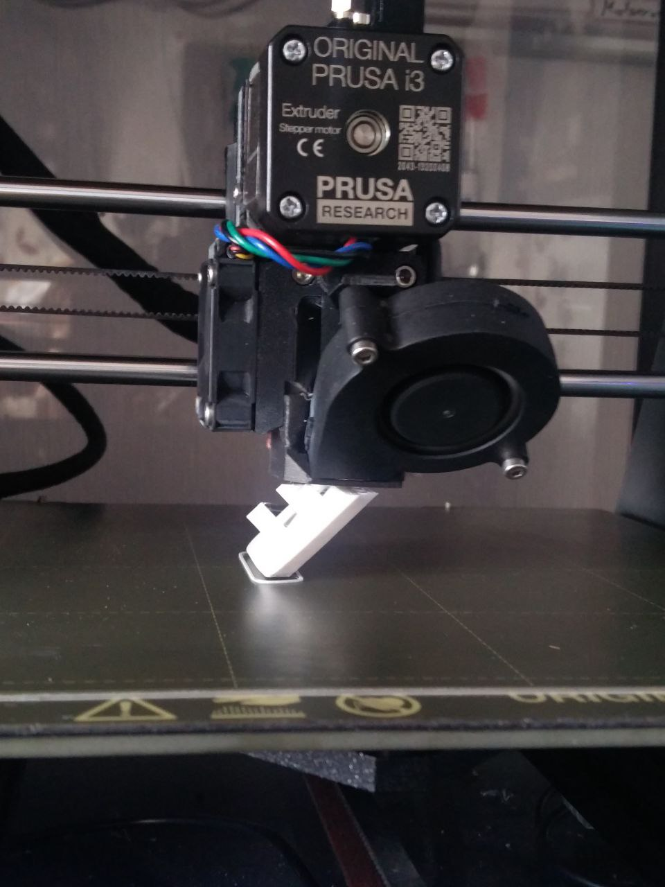

# tedox-curtain-rail-clip

Mounting clip for a tedox curtain rail.  
https://www.tedox.de/gardinenschiene.html

Printed at a 45 degree angle, so no support is required and the layers are not parallel to the fingers, which positively affects the strength.  

## License

This work is licensed under a [Creative Commons Attribution 4.0 International License][cc-by].

[![CC BY 4.0][cc-by-image]][cc-by]

[cc-by]: http://creativecommons.org/licenses/by/4.0/
[cc-by-image]: https://i.creativecommons.org/l/by/4.0/88x31.png